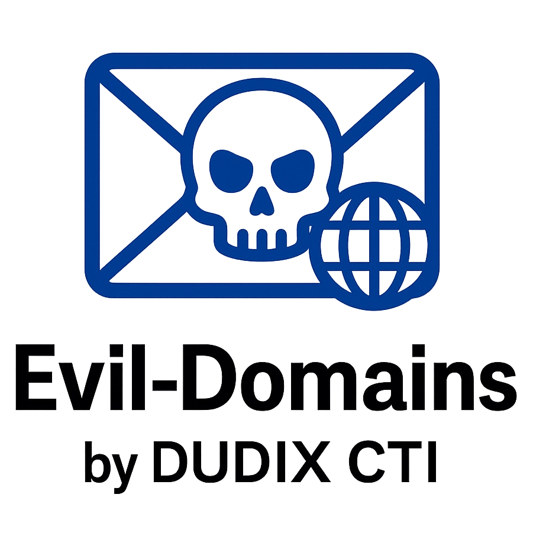

# Evil-Domains by DUDIX CTI

  

---

**But** : fournir un flux public et défensif de **domaines malveillants** collectés par DUDIX CTI (exports OpenCTI, STIX, CSV).
**Usage attendu** : threat hunting, blocage, corrélation, recherche. **Usage commercial interdit** sans accord écrit (voir licence).

---

## Contenu du dépôt

- `evil_domains.csv` — CSV simple : `type,domaine,decrtiption,opencti_score`

## Usage
- Usage défensif uniquement (threat hunting, blocage, corrélation).
- Vérifiez la qualité et la pertinence avant ingestion automatique.

---

## 🔖 Licence

📝 Licence libre [Creative Commons BY-NC-SA 4.0](https://creativecommons.org/licenses/by-nc-sa/4.0/)  
> *Utilisation personnelle, adaptation autorisée, mais pas d’usage commercial sans accord.*

---
